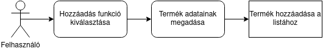
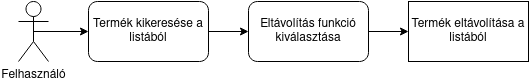
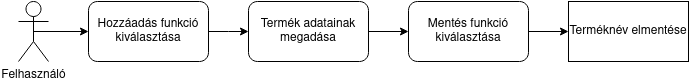
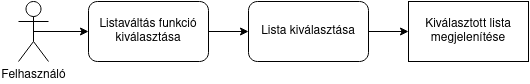
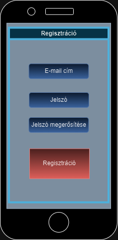

# Funkcionális specifikáció

## Jelenlegi helyzet leírása

## A rendszer céljai és nem céljai

A rendszer céljai:
- Egy olyan felület létrehozása, amelyet könnyű minden felhasználónak kezelnie
- Olyan listák létrehozása, amelyek eltárolódnak a memóriában, és csak a felhasználó szerkesztheti azokat
- A felhasználók segítése a bevásárlásban, hogy ne kelljen a fejükben tartaniuk a listát
- Amellett, hogy a termékek nevét felírhatják, az áruk kívánt mennyiségét is megadhatják a felhasználók, ha szükségük lenne csak egy bizonyos mennyiség vásárlására

Nem céljai:
- Egyes boltok kínálatának időbeli frissítése és kiírása (nem egy webes áruházat szeretnénk létrehozni)
- A piacon lévő termékek értékeinek összehasonlítása
- Keresőrendszer arra, hogy milyen terméket milyen áruházakban lehet megvásárolni

## Vágyálomrendszer leírása

A követelményspecifikációban részletezve. Vágyunk továbbra is az, hogy egy könnyen kezelhető szoftvert biztosítsunk a felhasználónak, amelyet kényelmes használni.

Azt szeretnénk, ha a felhasználónak nem kellene mást tennie, mint felírni a vásárolni kívánt termékeket az egyes listákba, ahol azok eltárolódnak, így a felhasználónak nem kell attól tartania, hogy bizonyos dolgokat elfelejt.

## Jelenlegi üzleti folyamatok leírása

## Igényelt üzleti folyamatok leírása

A vásárlást tervező felhasználónak lehetősége nyílik a regisztrációra, valamint ezzel párhuzamosan a
bejelentkezésre és (igény szerint) a profilok közötti váltásra a főoldalon, mely egy új oldalon folytatódik
(felhasználónév, jelszó). Belépést követően lehetősége nyílik egy új listát létrehozni (vagy meglévőt törölni),
azt elnevezni (vagy átnevezni), majd a listán belül termékeket hozzáadni/eltávolítani.
Emellett a kedvenc (gyakori) termékeit ki tudja jelölni, ezzel megkönnyítve a bevásárlólista feltöltését.

## Használati esetek

### Hozzáadás a listához

A felhasználó kiválasztja a hozzáadás funkciót, beírja a termék adatait, majd megtörténik a hozzáadás.

### Eltávolítás a listából

A felhasználó kiválasztja a terméket a listából, kiválasztja az eltávolítás funkciót, majd megtörténik az eltávolítás.

### Termék nevének lementése

A felhasználó kiválasztja a hozzáadás funkciót, megadja a termék adatait, majd a mentés funkciót kiválasztva megtörténik a terméknév elmentése.

### Termék nevének gyors kiválasztása

A felhasználó kiválasztja a hozzáadás funkciót, a termék adatainak beírása helyett kiválasztja a mentett termékek közül a terméket.

### Listaváltás

A felhasználó kiválasztja a listaváltás funkciót, majd a kívánt listát, ezután megjelenítődik a kiválasztott lista.

## Követelménylista

A követelményspecifikációban részletezve. A rendszer legfontosabb funkciói a k1, k2, k3, k4, a k9-nek való megfeleléssel együtt biztosítják a program megfelelő, alapvető működését. A k5, k6, k7, k8 követelmények pedig kényelmi funkciókat biztosítanak a felhasználó számára.

## Képernyőtervek

Különböző felületek, melyeket a felhasználó kezel:

