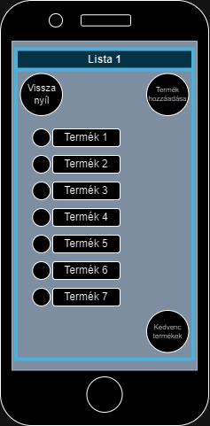
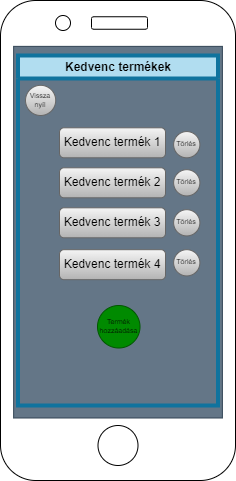

# Funkcionális specifikáció

## Jelenlegi helyzet leírása

Szeretnénk kibővítei a mai bevásárló lista írási lehetőségeinket.Ez az alkalmazás segítséget nyújt minden embernek a hétköznapi életben.
A XXI. század megköveteli, hogy a bevásárló listánk már a mobiltelefonunkon legyen és eszközünkröl könnyen hozzáférjünk és módosítsuk.
Ezért fogjuk létrehozni ezt az mobilos alkalmazást amiről egyszerűen tudunk létrehozni új bevásárló listát vagy törölni a meglévőt. 
Létrehozott listánkhoz tudunk hozzáadni vagy törölni vagy kedvemcek listájához hozzáadni.
Ezzel az alkamazással még egyszerűbb lesz ezek elkészítése és használata.

## A rendszer céljai és nem céljai

A rendszer céljai:
- Egy olyan felület létrehozása, amelyet könnyű minden felhasználónak kezelnie
- Olyan listák létrehozása, amelyek eltárolódnak a memóriában, és csak a felhasználó szerkesztheti azokat
- A felhasználók segítése a bevásárlásban, hogy ne kelljen a fejükben tartaniuk a listát
- Amellett, hogy a termékek nevét felírhatják, az áruk kívánt mennyiségét is megadhatják a felhasználók, ha szükségük lenne csak egy bizonyos mennyiség vásárlására

Nem céljai:
- Egyes boltok kínálatának időbeli frissítése és kiírása (nem egy webes áruházat szeretnénk létrehozni)
- A piacon lévő termékek értékeinek összehasonlítása
- Keresőrendszer arra, hogy milyen terméket milyen áruházakban lehet megvásárolni

## Vágyálomrendszer leírása

A követelményspecifikációban részletezve. Vágyunk továbbra is az, hogy egy könnyen kezelhető szoftvert biztosítsunk a felhasználónak, amelyet kényelmes használni.

Azt szeretnénk, ha a felhasználónak nem kellene mást tennie, mint felírni a vásárolni kívánt termékeket az egyes listákba, ahol azok eltárolódnak, így a felhasználónak nem kell attól tartania, hogy bizonyos dolgokat elfelejt.

## Jelenlegi üzleti folyamatok leírása

A mai világban a mindennapi teendőkhöz nem használjuk ki a már meglévő technológiát arra,
hogy megkönnyítsük a hétköznapi teendőinket és rendszeresebb legyen.
A jelenlegi világban a fiatalok egyre több mindent végeznek el okos esközeiken ezért szeretnénk
fejleszteni egz telefonos bevásárlólistát.Jelenleg az emberek papírra írják a listáikat ami a XXI. században
elavultnak számít. Ez a módszer sok időt vesz el a hétköznapokból és nem áttekinthető.

## Igényelt üzleti folyamatok leírása

Azért, hogy könnyebbé tegyük a vásárlást tervező emberek dolgát, létrehozunk egy alkalmazást, amely
a mindennapokban megfelelően helyt fog tudni állni az elektronikai világban.

A vásárlást tervező felhasználónak lehetősége nyílik egy/több új listát létrehozni (vagy meglévőt 
törölni), azt elnevezni (vagy átnevezni), majd a listán belül termékeket hozzáadni/eltávolítani. 
A termékeket el tudja nevezni, mennyiséget és mértéket is hozzá tud rakni. Emellett a kedvenc 
(gyakori) termékeit ki tudja jelölni, ezzel megkönnyítve a bevásárlólista feltöltését.

## Használati esetek

### A felhasználó által elvégezhető műveletek

A felhasználó kezdeményezi az összes olyan műveletet, ami a lista tartalmát befolyásolja.

#### Hozzáadás a listához

A felhasználó kiválasztja a hozzáadás funkciót, beírja a termék adatait, majd megtörténik a hozzáadás.

#### Eltávolítás a listából

A felhasználó kiválasztja a terméket a listából, kiválasztja az eltávolítás funkciót, majd megtörténik az eltávolítás.

#### Termék nevének lementése

A felhasználó kiválasztja a hozzáadás funkciót, megadja a termék adatait, majd a mentés funkciót kiválasztva megtörténik a terméknév elmentése.

#### Termék nevének gyors kiválasztása

A felhasználó kiválasztja a hozzáadás funkciót, a termék adatainak beírása helyett kiválasztja a mentett termékek közül a terméket.

#### Listaváltás

A felhasználó kiválasztja a listaváltás funkciót, majd a kívánt listát, ezután megjelenítődik a kiválasztott lista.

### Listakezelő műveletei

A listakezelő a megjelenítés függvény kivételével csakis felhasználói művelet hatására cselekedhet.

#### Megjelenítés

Az alkalmazás indulásakor és felhasználói műveletek után felhasználói beavatkozás nélkül hajtódik végre, megjeleníti a bevásárlólista elemeit.

## Követelménylista

Az alkalmazás legfontosabb funkcióinak megvalósításához a rendszernek meg kell felelnie a követelmény specifikációban felsorolt k1, k2, k3 és k4 funkcionális követelményeknek, valamint a megfelelő működés érdekében a k9 nem-funkcionális követelménynek.

A k1 követelmény előírja a lista megjelenítését, a k2 a lista tárolását, a k3 a listához való hozzáadást, a k4 pedig a listából való eltávolítást, ezek nélkül a rendszer nem tudná egy egyszerű bevásárlólista feladatait ellátni.

A k9 nem-funkcionális követelmény biztosítja a felhasználót, hogy csakis ő adhat hozzá a listához és távolíthat el belőle.

A k5, k6, k7 és k8 funkcionális követelmények extra kényelmi funkciókat adnak az alkalmazáshoz, amik többé teszik, mint egy egyszerű bevásárlólista.

A k5 és k6 követelmények termékek nevének mentését és gyors beállítását teszik lehetővé, könnyítve gyakran vásárolt termékek hozzáadását.

A k7 és k8 követelmények, pedig lehetővé teszik, hogy a felhasználó képes legyen több bevásárlólistát is kezelni.

## Képernyőtervek

#### Különböző felületek, melyeket a felhasználó kezel:

Az **első** képernyőterv a *főképernyőt* reprezentálja. Az alkalmazás elindítását követően ezt látja 
a felhasználó. Középen megtalálható az összes (felhasználó által) létrehozott lista egymás alá 
helyezve. Az alsó sorban pedig két gomb van feltüntetve: a "Beállítások" és a "Lista hozzáadása".

---
A **második** képernyőterv egy *listát* és annak elemeit mutatja be. Ezt a felületet a főképernyőről tudja
megközelíteni a felhasználó, egy már létrehozott listát megnyitva. A felső sorban két gomb szerepel:
egy "Vissza" gomb (ami visszavisz a főoldalra), valamint egy "Termék hozzáadása" gomb. Középen balra
helyezve látható az összes (felhasználó által) hozzáadott (bevásárlásra szánt) termék egymás alá 
helyezve. Végül az alsó sorban egy "Kedvenc termékek" gomb bemutatja a felhasználó kedvenc termékeit.

---
A **harmadik** képernyőterv egy olyan felület, amely egy listán belül a "Termék hozzáadása" gomb 
megnyomásával jelenik meg. Itt lehet megnevezni a hozzáadni kívánt *termék* nevét, annak mennyiségét 
és mértékét. Ezalatt pedig két gomb szerepel: a "Kedvencek közé" és az "OK" (amely visszavisz az 
adott listához).

---
A **negyedik** képernyőterv a felhasználó *kedvenc termékeit* sorolja fel. Ide egy adott listán belül a 
"Kedvenc termékek" gomb megnyomásával van lehetőség eljutni. Felső sorban szereplő "Vissza"gomb által
vissza lehet jutni a listához. A képernyő alján pedig újabb kedvenc termékeket tud hozzáadni a 
felhasználó a kedvenc termékeihez.

