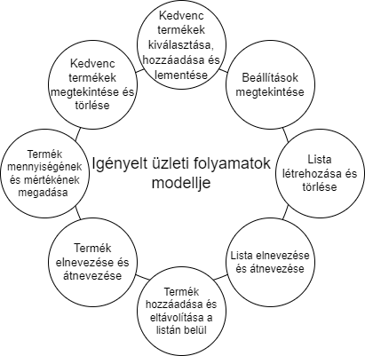

# Követelmény specifikáció

## Jelenlegi helyzet leírása

## Vágyálomrendszer leírása

A cél egy olyan szoftver létrehozása, amely gyorsabbá és egyszerűbbé teszi a bevásárlást az által, hogy egy ingyenes, könnyen használható bevásárló listát biztosít a felhasználónak.

A vágy az, hogy a felhasználónak csak le kelljen töltenie az alkalmazást, majd bejelentkezés után egyből el kezdheti tervezni azt, hogy milyen termékeket kell vásárolnia.

Vágyunk azt, hogy a szoftver több fontos funkcióval is rendelkezzen:

- Egyszerű szerkesztése a listának (egyszerű legyen hozzáadni, törölni a termékek nevét)
- Gyakran használt termékek nevének tárolása, gyors kiválasztása (pl. abban az esetben, ha gyakran veszünk egy terméket, legyen lehetőség annak nevének elmentésére, hogy később ne kelljen újra beírni)
  - Ezt úgy is el lehet képzelni, mint egy külön 'Favorites' listát, ahonnan gyorsan ki tudjuk választani kedvenc termékeink nevét
- Több bevásárló lista létrehozása, tárolása (pl. abban az esetben, ha más boltokban más termékeket szeretünk jobban vagy egyes boltokban olcsóbbak egyes termékek)
- A lista adatait csak a felhasználó változtathassa meg (pl. abban az esetben, ha több felhasználó is hozzáfér az eszközhöz, legyen egy olyan beléptetési rendszer, amely csak a saját listáinkat jeleníti meg, így csak azokhoz férünk hozzá)
- Egyszerű és kényelmes legyen használni (ide tartozik az is, hogy ingyenesen letölthető és használható)
- Esztétikailag vonzó legyen

## Jelenlegi üzleti folyamatok leírása
A mai világban az emberek körében egyre fontisabb a digitális átálás. A hagyományos "cetlis" bevásárló lista már nem a leghatékonyabb. Sokszor elkanlódik , nem tudjuk mi az ami már megvan a listáról vagy összekeverhetjük a listáinkat. Ezért tartjuk fontosnak a digitális bevásárlólistát. Így sokkal könnyebben tudják rendszerezni a listáikat és követni annak aktualitását. A lista és a hozzá adott elemeket lehet hozzáadni, átnevezni és törölni.

## Igényelt üzleti folyamatok modellje

## Követelménylista

| ID | Név | Kifejtés |
|----|-----|----------|
| k1 | Bevásárló lista megjelenítése | A programnak, könnyen értelmezhető módon meg kell jelenítenie a bevásárló listát|
| k2 | Bevásárló lista permanens tárolása | A bevásárló listát permanensen kell tárolni az adott eszközön |
| k3 | Termék hozzáadása a listához | A felhasználónak képesnek kell lennie termékeket hozzáadniuk a listához, ami eltávolásig tárolódik |
| k4 | Termék eltávolítása a listából | A felhasználónak képesnek kell lennie termékeket eltávolítani a bevásárló listából |
| k5 | Terméknév elmentése | A programnak tudnia kell tárolni a felhasználó által elmentett termékek neveit |
| k6 | Terméknév gyors kiválasztása | A felhasználónak képesnek kell lennie korábban elmentett terméknevek gyors kiválasztására |
| k7 | Több bevásárló lista tárolása | A programnak tudnia kell több bevásárlólistát eltárolni |
| k8 | Bevásárló listák közti váltás | A felhasználónak képesnek kell lennie a tárolt bevásárlólisták közti váltásra |
| k9 | Az adatokat csak a felhasználó módosíthatja | Az bevásárló listához csakis a felhasználó adhat hozzá és csakis ő távolíthat el belőle termékeket |