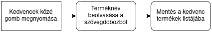

# Rendszerterv

## A rendszer célja

## Projektterv

## Üzleti folyamatok modellje

## Követelmények

Ez azoknak a követelményeknek a listája, amelyeket szeretnénk mindenképpen megvalósítani. Ezek a fejlesztés során változhatnak.

### Funkcionális követelmények

> ### Bevásárló lista megjelenítése
> **Röviden a követelménylistából**: A programnak könnyen értelmezhető módon kell megjelenítenie a bevásárló listát.
>
> A célunk az, hogy a felhasználó a mobiljáról könnyedén hozzáférhessen az alkalmazáshoz és kényelmesen használhassa azt. Fontos egy felhasználó-barát interfész kialakítása.
> 
> A felhasználó által készített bevásárlólistának akadálymentesen, bármilyen beavatkozás nélkül kell megjelennie az alkalmazáson belül.

> ### Bevásárló lista permanens tárolása
> **Röviden a követelménylistából**: A bevásárló listát permanens módon kell tárolni az adott eszközön.
> 
> Mivel azért hozzuk létre ezt a szoftvert, hogy a felhasználó helyett észben tartsa a bevásárlólistát, ezért biztosítanunk kell annak permanens tárolását.
> 
> Tervünk az, hogy a lista elemeit egy, az adott eszköz háttértárába elmentett .csv állományba fogjuk elmenteni, így az nem foglal sok helyet és nem bonyolult a frissítése sem.

> ### Termék hozzáadása a listához
> **Röviden a követelménylistából**: A felhasználónak képesnek kell lennie termékeket hozzáadni a listához, ami eltávolításig tárolódik.
> 
> Ahhoz, hogy a felhasználónak egyszerű dolga legyen, nem mi adunk a felhasználónak egy előre létrehozott, többezres nagyságrendű listát amiből ő válogathat, hanem megadjuk neki a lehetőséget, hogy a saját bevásárló listáját hozhassa létre.
> 
> Egy gomb megnyomása után a felhasználónak csak annyit kell tennie, hogy beírja a számára fontos termék nevét, mennyiségét és mértékegységét a megfelelő helyre, és azok az adatok hozzáadás után eltárolódnak.

> ### Termék eltávolítása a listából
> **Röviden a követelménylistából**: A felhasználónak képesnek kell lennie termékeket eltávolítani a listából.
> 
> Hogy a felhasználó egyszerűen kezelhesse a bevásárló listáját, biztosítani kell arra módszert, hogy jelezhesse magának ha már megvette a listán található terméket, vagy ha már nincs szüksége rá.
> 
> A törlés kivitelezésével a termék adatai törlődnek mind az alkalmazásból és az eszköz háttértárán tárolt listából is.

> ### Terméknév elmentése/Kedvencekhez adás
> **Röviden a követelménylistából**: A programnak tudnia kell tárolni a felhasználó által elmentett termékek neveit.
> 
> Azt szeretnénk, hogy a felhasználónak kényelmes legyen használnia ezt a szoftvert, ezért megadunk egy olyan lehetőséget, hogy a felhasználó tetszés szerint elmenhesse a kedvenc termékeit egy külön listába.
> 
> Az ilyen termékek adatait a felhasználó elmenheti a termék listához adása közben vagy egy külön 'Kedvenc termékek' lista használatával is.

> ### Terméknév gyors kiválasztása
> **Röviden a követelménylistából**: A felhasználónak képesnek kell lennie korábban elmentett terméknevek gyors kiválasztására.
> 
> Célunk ugyancsak az, hogy a felhasználónak még egyszerűbb dolga legyen.
> 
> A már 'Kedvenc termékek' listához hozzáadott terméknevek megjelennek, ha a felhasználó hasonló, esetleg ugyanazt a terméket kezdi el beírni a bevásárló listájába. Ezzel is szeretnénk könnyebbé tenni a lista létrehozását.

> ### Több bevásárló lista tárolása
> **Röviden a követelménylistából**: A programnak tudnia kell több bevásárlólistát is tárolni.
> 
> Hasonlóan a 'Bevásárló lista permanens tárolása' ponthoz, ezzel a követelménnyel is azt szeretnénk elérni, hogy a felhasználónak ne kelljen több listát is fejben tartania.
> 
> A több listás megoldás egyesek számára csak kényelmi opciót fog jelenteni, ha külön listákba szeretnék írni azokat a termékeket, amiket külön boltokban vesznek meg, de fontos megadni erre is a lehetőséget.

> ### Bevásárló listák közti váltás
> **Röviden a követelménylistából**: A felhasználónak képesnek kell lennie a tárolt bevásárló listák közti váltásra.
> 
> Ha a felhasználó több listába szeretné elmenteni a kívánt termékeket, akkor biztosítanunk kell arra lehetőséget, hogy a különböző listák között gyorsan és egyszerűen válthasson.
> 
> A 'Listaváltás' funkció már a főmenüből elérhető lesz, így a felhasználó bármikor könnyedén válthat a listák között.


## Funkcionális terv

### Menühierarchia

A kezdőképernyő a Listaválasztás, a téglalapok menük, a kerekített sarkú téglalapok pedig funkciók.


### Lista megjelenítése

A lista megjelenítése egy automatikusan meghívott függvény, ami megjeleníti a képernyőn a kiválasztott listát. Az lista kiválasztásakor és minden listaművelet után meghívásra kerül.


Megjeleníti a képernyőn, egymás alatt a memóriába betöltött lista elemeit.


### Hozzáadás listához

A hozzáadás függvényt a felhasználó gombnyomásra hívja meg, a memóriában lévő és a háttértáron lévő listát is frissíti a művelettel.


A hozzáadás funkciót a kezdetben megjelenő képernyő "Termék hozzáadása" gombjával érhető el. Megadandó adatok a termék neve, a mennyiség és a mennyiség mértékegysége. Ezek után az OK gomb meghívja a hozzáadó függvényt.


### Kedvencekhez adás

#### Hozzáadás menüből

A kedvencekhez adás menti a beírt terméknevet későbbi gyors kiválasztáshoz.



A hozzáadás menüjében a "Kedvencek közé" gombbal elérhető.


#### Kedvenc termékek listából

A "Termék hozzáadása" gomb megnyomása után meg kell adni a termék nevét, majd jóváhagyni és hozzáadódik a listához.


A kedvencekhez adás a "Termék hozzáadása" gombbal történik.


### Törlés a listából

A törlő függvény a memóriában tártolt listából és a háttértáron tárolt listából is törli az adott elemet.


A listanézetben a listaelemre kattintva érhető el a törlés funkció.


### Kedvencek listájának megjelenítése

A kedvencek megjelenítése hasonló módon történik, mint a bevásárlólista megjelenítése, vagyis automatikusan történik a kedvenc termékek menüpont megnyitásakor.


A kedvencek hasonlóan jelennek meg, mint a bevásárlólista elemei.


### Kedvencekből való törlés

A kedvencek menü megnyitásakor látható a termék neve mellett egy törlés gomb, ami törli az adott elemet.

### Lista tárolása a háttértáron

A lista tárolása egyszerű csv formátumban történik, aminek a felépítése a következő:

```
termeknev1,mennyiseg1,mertekegyseg1
termeknev2,mennyiseg2,mertekegyseg2
.
.
.
```

Egy külön osztály felelős a lista beolvasásáért és kiírásáért, a lista háttértáron lévő verziójának mindig a memóriában lévő verzióval együtt kell frissülnie.

## Fizikai környezet

Az alkalmazást JAVA platformon fejlesztjük, android 7.0 (Nougat) és újabb verziójú eszközökre.

A JAVA platformra a nyelv operációs rendszer függetlensége miatt esett a választás.

Azért fejlesztjük az alkalmazást android 7.0 és újabb verziójú eszközökre, mert az android visszafele kompatibilitása és a statisztikák szerint a jelenleg használt androidos eszközök 95,4%-án futni fog az alkalmazás.

A fejlesztéshez az Android Studio IDE-t fogjuk használni.

Az alkalmazás várható hardverkövetelménye elhanyagolható lesz, ezért tervek szerint bármilyen android 7.0-át és újabb verziót futtató eszközök képesek lesznek a futtatására.

Az alkalmazás nem kommunikál majd semmilyen külső szerverrel vagy API-val, minden adat tárolása lokálisan történik és nem továbbítódik külső félnek.

## Absztrakt domain modell

## Architektúrális terv

## Tesztterv

## Telepítési terv
